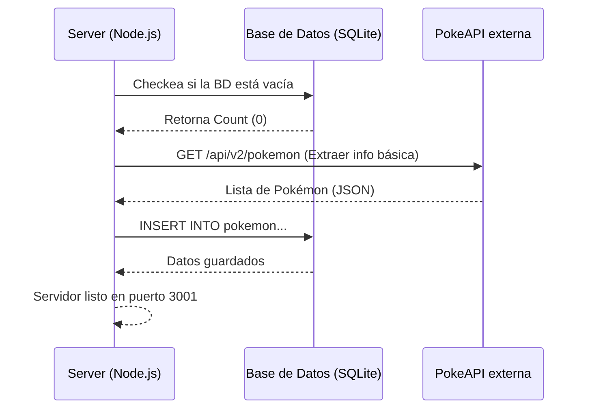
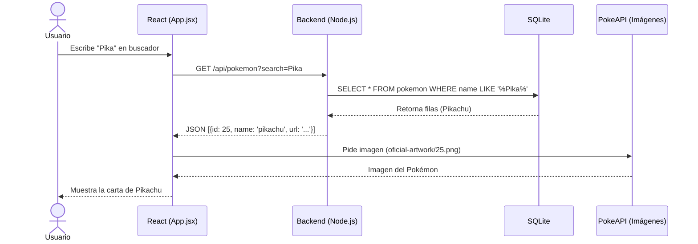

# PokéDex Pro

Aplicación de biblioteca de Pokémon desarrollada con **React** (Front-end) y **Node.js + SQLite** (Back-end), cumpliendo todos los requisitos solicitados.

## Requisitos cumplidos
- ✅ Base de datos con información de todos los pokemons (SQLite).
- ✅ Extraer imagen desde API externa (PokeAPI).
- ✅ Listado filtrable.
- ✅ Uso de React para el Frontend (estilizado con Glassmorphism moderno).
- ✅ Uso de Node.js en el Backend.

---

## Diagramas de Casos de Uso

### 1. Caso de Uso: Buscar un Pokémon
```mermaid
usecaseDiagram
    actor Usuario
    usecase "Buscar Pokémon" as UC1
    usecase "Filtrar resultados" as UC2
    usecase "Ver lista vacía (si no hay)" as UC3
    
    Usuario --> UC1
    UC1 ..> UC2 : include
    UC1 ..> UC3 : extends
```

### 2. Caso de Uso: Visualizar Información de la Biblioteca
```mermaid
usecaseDiagram
    actor Usuario
    usecase "Acceder a PokéDex" as UC1
    usecase "Ver lista completa de Pokémon" as UC2
    usecase "Ver imagen y nombre del Pokémon" as UC3
    
    Usuario --> UC1
    UC1 --> UC2
    UC2 ..> UC3 : include
```

---

## Diagramas de Secuencia

### 1. Inicialización de la Base de Datos y Caché


### 2. Búsqueda y Filtrado desde el Front-end


## Instalación y Ejecución

### 1. Cargar el backend
```bash
cd backend
npm install
node server.js
```

### 2. Cargar el frontend
```bash
cd frontend
npm install
npm run dev
```
