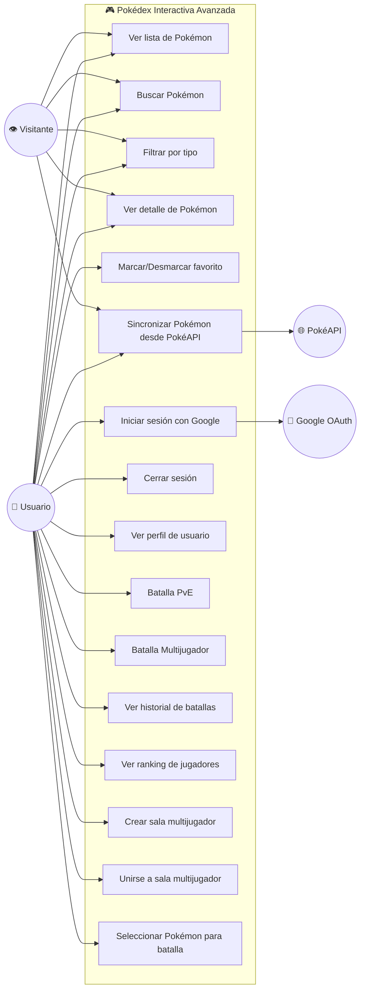
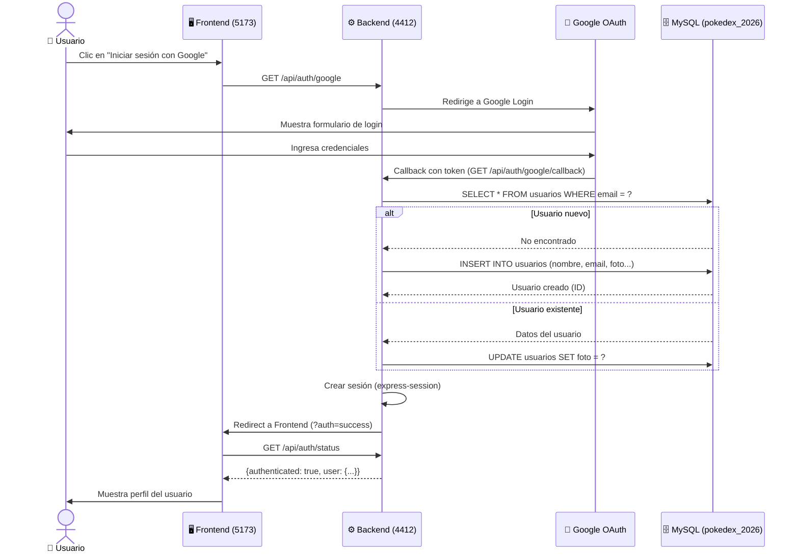
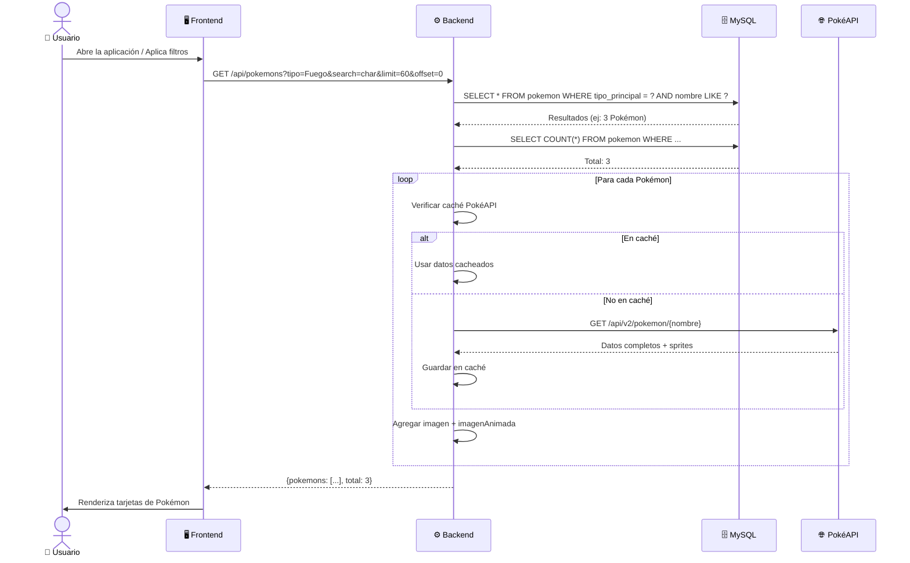
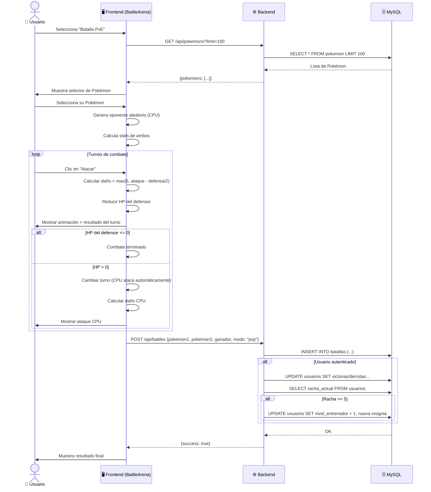
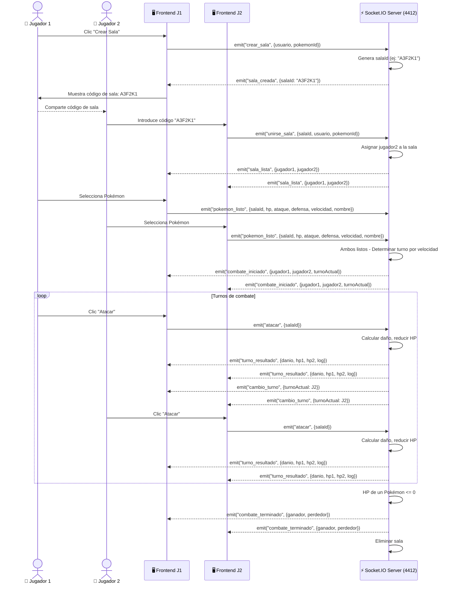
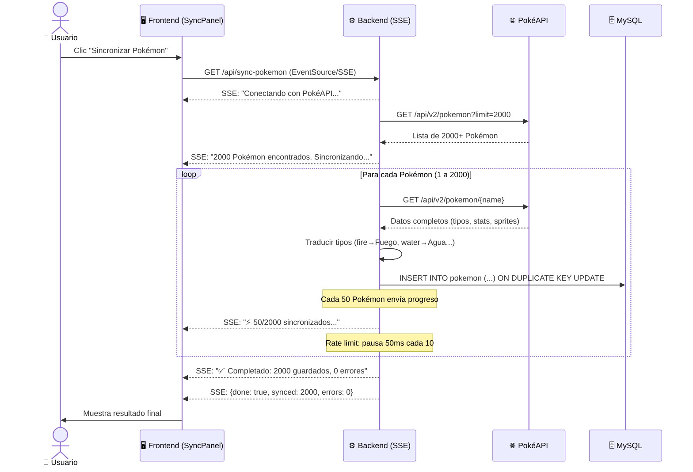
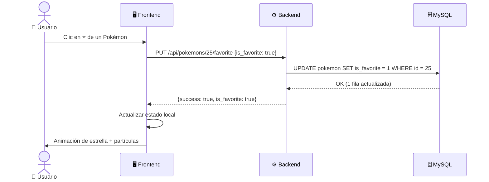

# Diagramas UML - Pokédex Interactiva Avanzada 2026

## 1. Diagrama de Casos de Uso

---

## 2. Diagrama de Secuencia - Autenticación con Google

---

## 3. Diagrama de Secuencia - Consultar Pokémon

---

## 4. Diagrama de Secuencia - Batalla PvE

---

## 5. Diagrama de Secuencia - Batalla Multijugador (Socket.IO)

---

## 6. Diagrama de Secuencia - Sincronización de Pokémon

---

## 7. Diagrama de Secuencia - Marcar Favorito

---

> **📝 Nota:** Para visualizar estos diagramas puedes:
> - Abrir este archivo `.md` en **VS Code** con la extensión "Markdown Preview Mermaid Support"
> - Pegarlo en [mermaid.live](https://mermaid.live)
> - Usar cualquier visor de Markdown que soporte Mermaid
